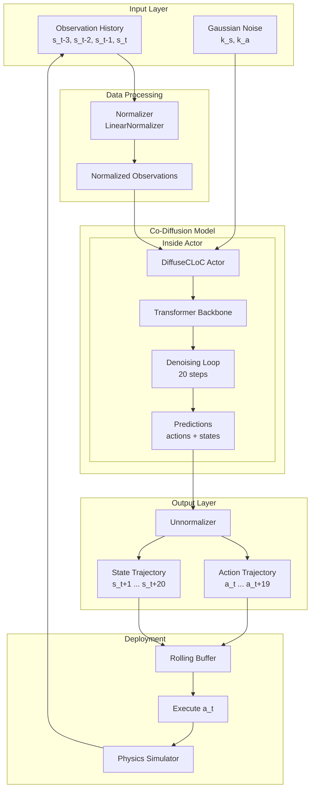
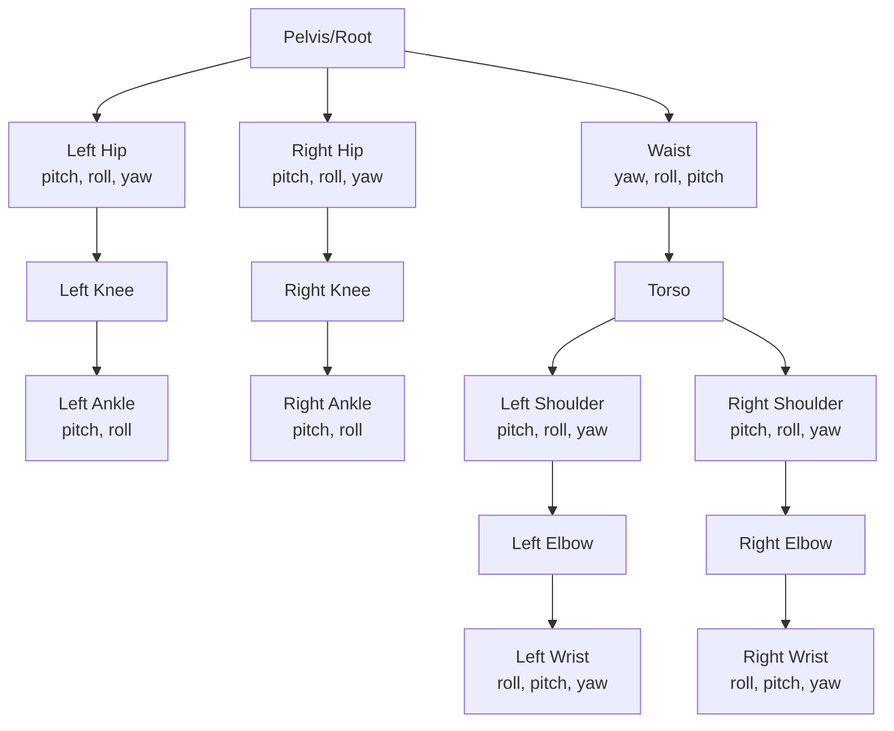
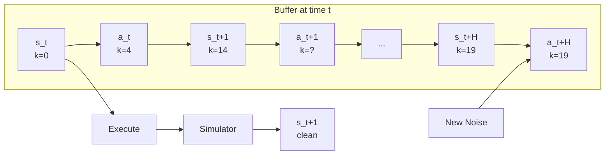
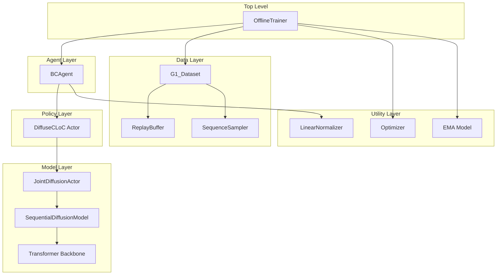

# Architecture Overview

## High-Level System Architecture

DiffuseCLoC is a physics-based character control system that uses co-diffusion to generate both future states and actions. The system architecture consists of several key components working together:



## Core Mathematical Framework

### Trajectory Representation

At timestep $t$, the model predicts a trajectory containing interleaved states and actions:

$$\boldsymbol{\tau}_t = [\boldsymbol{s}_t, \boldsymbol{a}_t, \boldsymbol{s}_{t+1}, \boldsymbol{a}_{t+1}, \ldots, \boldsymbol{s}_{t+H}, \boldsymbol{a}_{t+H}]$$

where:
- $H = 20$ is the prediction horizon (~0.625 seconds at 32 Hz)
- $\boldsymbol{s}_t \in \mathbb{R}^{384}$ is the state vector at time $t$
- $\boldsymbol{a}_t \in \mathbb{R}^{29}$ is the action vector at time $t$

### Observation History

The model conditions on past observations:

$$\boldsymbol{O}_t = [\boldsymbol{s}_{t-3}, \boldsymbol{s}_{t-2}, \boldsymbol{s}_{t-1}, \boldsymbol{s}_t]$$

where $N_{\text{past}} = 4$ timesteps (~0.125 seconds)

### Co-Diffusion Process

The model jointly diffuses states and actions with **independent noise schedules**:

$$\boldsymbol{\tau}_t^{\boldsymbol{k}} = \sqrt{\bar{\alpha}_{\boldsymbol{k}}} \boldsymbol{\tau}_t + \sqrt{1 - \bar{\alpha}_{\boldsymbol{k}}} \boldsymbol{\epsilon}$$

where:
- $\boldsymbol{k} = (\boldsymbol{k}_s, \boldsymbol{k}_a)$ are independent noise levels
- $\boldsymbol{k}_s, \boldsymbol{k}_a \in [0, K-1]^{H+1}$ with $K = 20$ denoising steps
- $\bar{\alpha}_{\boldsymbol{k}}$ are the cumulative noise schedule coefficients (cosine schedule)

### Denoising Prediction

The transformer backbone predicts the clean trajectory:

$$\hat{\boldsymbol{\tau}}_t = f_\theta(\boldsymbol{\tau}_t^{\boldsymbol{k}}, \boldsymbol{O}_t, \boldsymbol{k})$$

where $f_\theta$ is the transformer with parameters $\theta$.

### DDPM Sampling

The reverse diffusion process follows DDPM sampling:

$$\boldsymbol{\tau}_t^{\boldsymbol{k}-1} = \frac{1}{\sqrt{\alpha_{\boldsymbol{k}}}} \left( \boldsymbol{\tau}_t^{\boldsymbol{k}} - \frac{1-\alpha_{\boldsymbol{k}}}{\sqrt{1-\bar{\alpha}_{\boldsymbol{k}}}} \boldsymbol{\epsilon}_\theta \right) + \sigma_{\boldsymbol{k}} \boldsymbol{z}$$

where:
- $\boldsymbol{\epsilon}_\theta = \frac{\boldsymbol{\tau}_t^{\boldsymbol{k}} - \sqrt{\bar{\alpha}_{\boldsymbol{k}}} \hat{\boldsymbol{\tau}}_t}{\sqrt{1-\bar{\alpha}_{\boldsymbol{k}}}}$ (predicted noise)
- $\sigma_{\boldsymbol{k}}$ is the noise variance
- $\boldsymbol{z} \sim \mathcal{N}(0, \boldsymbol{I})$ for $\boldsymbol{k} > 0$, else $\boldsymbol{z} = 0$

### Training Objective

The model is trained with mean squared error on the predicted clean trajectory:

$$\mathcal{L} = \mathbb{E}_{\boldsymbol{k}, \boldsymbol{\epsilon}} \left[ \| \hat{\boldsymbol{\tau}}_t - \boldsymbol{\tau}_t \|^2 \right]$$

Split into state and action losses:

$$\mathcal{L} = \mathcal{L}_{\text{state}} + \mathcal{L}_{\text{action}}$$

where:
- $\mathcal{L}_{\text{state}} = \| \hat{\boldsymbol{s}} - \boldsymbol{s} \|^2$ weighted by temporal weights
- $\mathcal{L}_{\text{action}} = \| \hat{\boldsymbol{a}} - \boldsymbol{a} \|^2$ with joint-specific weights

## State Representation (384-dimensional)

The state vector consists of body-centric features:

### Body Features (per body, 30 bodies)
1. **Body Positions** (90-dim): $\mathbb{R}^{30 \times 3}$
   - 3D Cartesian positions relative to character frame
   
2. **Body Linear Velocities** (90-dim): $\mathbb{R}^{30 \times 3}$
   - 3D linear velocities in character frame

### Root Features
3. **Root Position** (3-dim): $\mathbb{R}^3$
   - Relative position in character frame
   
4. **Root Rotation** (3-dim): $\mathbb{R}^3$
   - Rotation vector (axis-angle) relative to heading
   
5. **Root Linear Velocity** (3-dim): $\mathbb{R}^3$
   - Linear velocity in character frame
   
6. **Root Angular Velocity** (3-dim): $\mathbb{R}^3$
   - Angular velocity in character frame

### End-Effector Features (optional, used in G1_Dataset_EE)
7. **End-Effector Rotations** (varies): Additional orientation info

**Total**: $90 + 90 + 3 + 3 + 3 + 3 = 192$ base dimensions

### Character Frame Normalization

All states are normalized to a **character-centric frame** defined by:
- **Origin**: Root position at the nominal frame (frame index 3 in history)
- **Orientation**: Yaw-only rotation (gravity-aligned)

This normalization removes global translation and rotation, making the problem translation and rotation invariant.

## Action Representation (29-dimensional)

Actions are target joint positions for a PD controller:

$$\boldsymbol{a}_t = [q_1^{\text{target}}, q_2^{\text{target}}, \ldots, q_{29}^{\text{target}}] \in \mathbb{R}^{29}$$

### Joint Hierarchy (Humanoid G1 Robot)



### Joint Order
1. Hip joints (6): left/right × pitch/roll/yaw
2. Waist joints (3): yaw/roll/pitch
3. Knee joints (2): left/right
4. Shoulder joints (6): left/right × pitch/roll/yaw
5. Ankle joints (4): left/right × pitch/roll
6. Elbow joints (2): left/right
7. Wrist joints (6): left/right × roll/pitch/yaw

**Total**: 29 actuated joints

## Key Architectural Innovations

### 1. Independent Noise Schedules

Unlike standard diffusion models, DiffuseCLoC uses **separate noise levels** for states and actions:

- **State noise** $\boldsymbol{k}_s$: Can denoise at different rates
- **Action noise** $\boldsymbol{k}_a$: Allows faster action convergence

This decoupling enables the model to:
- Denoise actions faster than states
- Implement rolling inference with partial denoising
- Apply different emphasis to state vs. action prediction

### 2. Asymmetric Attention Mechanism

The transformer uses different attention patterns for states and actions:

**Actions** (Causal):
- Attend to: past actions, past states, current state
- Do NOT attend to: future states, future actions
- **Rationale**: Prevents contamination from noisy future predictions

**States** (Non-Causal):
- Attend to: all past and future states
- Do NOT attend to: any actions
- **Rationale**: Enables future information flow for planning

### 3. State Emphasis Projection

To emphasize global states (root position, velocities), the model applies a learned projection:

$$\boldsymbol{s}_{\text{proj}} = [\boldsymbol{AB} \cdot \boldsymbol{s} \quad | \quad \boldsymbol{s}]$$

where:
- $\boldsymbol{A} \in \mathbb{R}^{d \times d}$ is a random Gaussian matrix
- $\boldsymbol{B}$ is diagonal with entries $> 1$ for global features
- This doubles the state dimension for emphasis

### 4. Rolling Inference Scheme

For online deployment, the model maintains a FIFO buffer:



**Benefits**:
- **Consistency**: Smooth transitions between timesteps
- **Speed**: 25% faster than full denoising
- **Guidance**: Stronger classifier guidance possible

## System Data Flow

```mermaid
sequenceDiagram
    participant Env as Environment
    participant Agent as BCAgent
    participant Actor as DiffuseCLoC
    participant Backbone as Transformer
    participant Norm as Normalizer
    
    Env->>Agent: Raw observation s_t
    Agent->>Norm: Normalize state
    Norm->>Actor: Normalized observation
    
    loop Denoising (20 steps)
        Actor->>Backbone: Noisy trajectory + noise level
        Backbone->>Actor: Predicted clean trajectory
        Actor->>Actor: DDPM update step
    end
    
    Actor->>Agent: Clean predictions (actions, states)
    Agent->>Norm: Unnormalize actions
    Norm->>Env: Execute action a_t
    Env->>Agent: Next state s_t+1
```

## Component Hierarchy



## Key Design Principles

1. **Modularity**: Clear separation between diffusion mechanics, transformer architecture, and training
2. **Flexibility**: Support for different attention patterns, noise schedules, and state representations
3. **Efficiency**: Rolling inference, state emphasis, and optimized attention masks
4. **Guidability**: Designed to support classifier-free guidance for task-specific control
5. **Symmetry**: Built-in support for left-right symmetry augmentation
