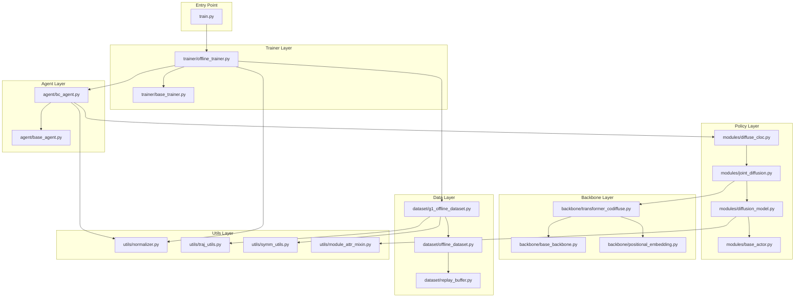

# File Structure and Dependencies

## Package Organization

```
diffusion_diffuse_cloc/
├── diffusion_policy/              # Main package
│   ├── __init__.py
│   ├── backbone/                  # Neural network architectures
│   │   ├── __init__.py
│   │   ├── base_backbone.py       # Abstract base classes
│   │   ├── transformer_codiffuse.py  # Co-diffusion transformer
│   │   ├── positional_embedding.py   # Sinusoidal embeddings
│   │   └── ema_model.py           # Exponential moving average
│   │
│   ├── modules/                   # Diffusion models and actors
│   │   ├── __init__.py
│   │   ├── base_actor.py          # Actor interface
│   │   ├── diffusion_model.py     # Base DDPM implementation
│   │   ├── policy_diffusion.py    # Single diffusion actor
│   │   ├── joint_diffusion.py     # Joint state-action diffusion
│   │   └── diffuse_cloc.py        # DiffuseCLoC implementation
│   │
│   ├── dataset/                   # Data loading and processing
│   │   ├── __init__.py
│   │   ├── offline_dataset.py     # Base dataset classes
│   │   ├── g1_offline_dataset.py  # G1 robot dataset variants
│   │   ├── replay_buffer.py       # Zarr-based storage
│   │   └── sampler.py             # Sequence sampling
│   │
│   ├── trainer/                   # Training infrastructure
│   │   ├── __init__.py
│   │   ├── base_trainer.py        # Base trainer class
│   │   └── offline_trainer.py     # Offline training loop
│   │
│   ├── agent/                     # Agent implementations
│   │   ├── __init__.py
│   │   ├── base_agent.py          # Agent interface
│   │   └── bc_agent.py            # Behavior cloning agent
│   │
│   ├── utils/                     # Utility modules
│   │   ├── __init__.py
│   │   ├── normalizer.py          # Data normalization
│   │   ├── pytorch_util.py        # PyTorch utilities
│   │   ├── tensor_util.py         # Tensor operations
│   │   ├── traj_utils.py          # Trajectory/quaternion math
│   │   ├── symm_utils.py          # Symmetry operations
│   │   ├── module_attr_mixin.py   # Device tracking mixin
│   │   ├── module_dict.py         # Custom dict for modules
│   │   └── lr_scheduler.py        # Learning rate scheduling
│   │
│   └── config_files/              # Hydra configurations
│       └── joint_diffuse.yaml     # Main config file
│
├── doc/                           # Documentation
│   ├── README.md
│   ├── 01_architecture_overview.md
│   ├── 02_file_structure.md       # This file
│   └── ...
│
└── train.py                       # Training entry point (likely)
```

## Module Dependencies

### Dependency Graph



## Core Modules Description

### 1. Backbone (`backbone/`)

**Purpose**: Neural network architectures for processing sequential data.

#### `base_backbone.py`
- **Classes**: 
  - `SequentialBackbone`: Abstract base for sequence models
  - `ConditionalSeqBackbone`: Base for conditional sequence models
  - `JointSeqBackbone`: Base for joint state-action models
- **Key Methods**: `forward()`, `get_optimizer()`
- **Dependencies**: PyTorch, `module_attr_mixin`

#### `transformer_codiffuse.py`
- **Classes**: `Transformer(JointSeqBackbone)`
- **Key Features**:
  - Interleaved state-action tokens
  - Custom attention masks (causal for actions, non-causal for states)
  - Separate embedding for states and actions
  - Positional encoding
- **Parameters**: 19.95M parameters
- **Dependencies**: `base_backbone`, `positional_embedding`

#### `positional_embedding.py`
- **Classes**: `SinusoidalPosEmb`
- **Purpose**: Sinusoidal positional embeddings for time/noise levels
- **Formula**: Uses sin/cos with exponentially varying frequencies

#### `ema_model.py`
- **Classes**: `EMAModel` (from diffusers library)
- **Purpose**: Exponential moving average of model parameters for stable inference

---

### 2. Modules (`modules/`)

**Purpose**: Diffusion models and actor implementations.

#### `base_actor.py`
- **Classes**: `BaseActor`
- **Purpose**: Interface for policy actors
- **Key Methods**: `act()`, `get_optimizer()`

#### `diffusion_model.py`
- **Classes**: `SequentialDiffusionModel`
- **Key Features**:
  - DDPM implementation (cosine schedule)
  - Forward/reverse diffusion process
  - Noise prediction and x0 prediction modes
- **Key Methods**:
  - `q_sample()`: Forward diffusion
  - `p_mean_var()`: Reverse diffusion step
  - `DDPM_init()`: Initialize noise schedules
  - `predict_x0_from_epsilon()`: Convert noise to clean prediction
- **Dependencies**: `base_backbone`, `module_attr_mixin`

#### `joint_diffusion.py`
- **Classes**: `JointDiffusionActor(SequentialDiffusionModel, BaseActor)`
- **Key Features**:
  - Co-diffuses states and actions with independent noise schedules
  - Temporal loss weighting
  - Joint-specific action loss weights
  - Clean past state inpainting
- **Key Methods**:
  - `act()`: Generate actions and states via denoising
  - `p_losses()`: Compute training loss
  - `diffuse_step()`: Single denoising iteration
- **Dependencies**: `diffusion_model`, `base_actor`, transformer backbone

#### `diffuse_cloc.py`
- **Classes**: `DiffuseCLoC(JointDiffusionActor)`
- **Key Features**:
  - Rolling inference with FIFO buffer
  - State emphasis projection
  - Random noise schedule generation
- **Key Methods**:
  - `act()`: Inference with rolling scheme
  - `generate_denoising_matrix()`: Creates noise schedules
  - `get_emphasis_projection()`: Builds state projection matrix
  - `get_rolling_traj()`: Manages rolling buffer
- **Novel Parameters**:
  - `state_emphasis`: Projection strategy ('random_emph_symm', 'same', etc.)
  - `action_schedule`, `state_schedule`: Rolling noise patterns
- **Dependencies**: `joint_diffusion`

---

### 3. Dataset (`dataset/`)

**Purpose**: Data loading, normalization, and sampling.

#### `replay_buffer.py`
- **Classes**: `ReplayBuffer`
- **Purpose**: Zarr-based storage for trajectory data
- **Key Features**:
  - Memory-efficient compressed storage
  - Episode-based organization
  - Chunked array operations
- **Key Methods**:
  - `copy_from_path()`: Load from disk
  - `add_episode()`: Append new data
  - `get_episode()`: Retrieve episode
- **Dependencies**: zarr, numcodecs, numpy

#### `offline_dataset.py`
- **Classes**: 
  - `BaseDataset`: Abstract dataset interface
  - `OfflineDataset`: Base for offline training
- **Key Features**:
  - Sequence sampling with padding
  - Validation split
  - Normalizer creation
- **Key Methods**:
  - `get_normalizer()`: Fit normalizer to data
  - `get_validation_dataset()`: Create val split
  - `state_normalize()`: Abstract normalization method
- **Dependencies**: `replay_buffer`, PyTorch Dataset

#### `g1_offline_dataset.py`
- **Classes**:
  - `G1DatasetBase`: Shared functionality
  - `G1_Dataset`: Standard state representation
  - `G1_Dataset_EE`: Adds end-effector rotations
  - `G1_Dataset_limited`: Subset of bodies
- **Key Features**:
  - Character-frame normalization (yaw-aligned)
  - Quaternion to rotation vector conversion
  - Left-right symmetry augmentation
- **Key Methods**:
  - `state_normalize()`: Transform to character frame
  - `state_unnormalize()`: Back to global coordinates
  - `collate_fn()`: Batch processing with augmentation
  - `get_reflection_ops()`: Symmetry operators
- **Dependencies**: `offline_dataset`, `traj_utils`, `symm_utils`

---

### 4. Trainer (`trainer/`)

**Purpose**: Training loop and checkpoint management.

#### `base_trainer.py`
- **Classes**: `BaseTrainer`
- **Key Features**:
  - Wandb integration
  - Checkpoint save/load
  - Abstract training interface
- **Key Methods**:
  - `save_checkpoint()`: Save model state
  - `load_checkpoint()`: Restore from checkpoint
  - `load_payload()`: Load state dicts
- **Dependencies**: Hydra, wandb, torch

#### `offline_trainer.py`
- **Classes**: `OfflineTrainer(BaseTrainer)`
- **Key Features**:
  - Full training loop
  - EMA model management
  - Gradient accumulation
  - Learning rate scheduling
- **Key Methods**:
  - `train()`: Main training loop
  - Handles data loading, loss computation, optimization
- **Training Flow**:
  1. Load dataset and create dataloader
  2. Initialize agent, optimizer, scheduler
  3. For each epoch:
     - Batch iteration with loss computation
     - Gradient accumulation and optimization step
     - EMA update
     - Checkpoint saving
- **Dependencies**: `base_trainer`, agent, dataset, optimizer utils

---

### 5. Agent (`agent/`)

**Purpose**: High-level policy interface.

#### `base_agent.py`
- **Classes**: `BaseAgent`
- **Key Features**:
  - Normalizer management
  - Abstract interface for policies
- **Key Methods**:
  - `set_normalizer()`: Attach data normalizer
  - `get_optimizer()`: Create optimizer(s)

#### `bc_agent.py`
- **Classes**: `BCAgent(BaseAgent)`
- **Purpose**: Behavior cloning agent wrapper
- **Key Methods**:
  - `act()`: Inference (normalize → actor → unnormalize)
  - `compute_loss()`: Training loss computation
  - `get_optimizer()`: Returns dict of optimizers
- **Supported Actors**: `DiffusionActor`, `JointDiffusionActor`
- **Dependencies**: `base_agent`, actor modules, normalizer

---

### 6. Utils (`utils/`)

**Purpose**: Shared utility functions.

#### `normalizer.py`
- **Classes**: 
  - `LinearNormalizer`: Multi-field normalizer
  - `SingleFieldLinearNormalizer`: Single tensor normalizer
- **Modes**: 
  - `'limits'`: Min-max scaling to [-1, 1]
  - `'gaussian'`: Zero-mean, unit-variance
- **Key Methods**:
  - `fit()`: Compute normalization statistics
  - `normalize()` / `unnormalize()`: Transform data
- **Dependencies**: PyTorch, zarr

#### `traj_utils.py`
- **Functions**:
  - Quaternion operations: `quat_mul()`, `quat_conjugate()`, `quat_rotate()`
  - Euler conversions: `quat_from_euler_xyz()`, `get_euler_xyz()`
  - Manifold operations: `box_minus()`, `box_plus()` for SO(3)
  - Rotation utilities: `get_yaw_quat()`
- **Dependencies**: PyTorch, scipy.spatial.transform

#### `symm_utils.py`
- **Functions**:
  - `get_reflect_reps()`: Generate reflection matrices
  - `get_reflect_op()`: Build symmetry operator
- **Purpose**: Left-right symmetry for data augmentation

#### `pytorch_util.py`
- **Functions**:
  - `dict_apply()`: Apply function to nested dicts
  - `optimizer_to()`: Move optimizer to device
- **Purpose**: General PyTorch helpers

#### `module_attr_mixin.py`
- **Classes**: `ModuleAttrMixin`
- **Purpose**: Automatic device tracking for nn.Module
- **Features**: Adds `self.device` property

---

## Import Patterns

### Typical Training Script Flow

```python
# 1. Configuration
import hydra
from omegaconf import OmegaConf

# 2. Trainer
from diffusion_policy.trainer.offline_trainer import OfflineTrainer

# 3. Agent (instantiated via Hydra)
from diffusion_policy.agent.bc_agent import BCAgent

# 4. Actor (instantiated via Hydra)
from diffusion_policy.modules.diffuse_cloc import DiffuseCLoC

# 5. Backbone (instantiated via Hydra)
from diffusion_policy.backbone.transformer_codiffuse import Transformer

# 6. Dataset (instantiated via Hydra)
from diffusion_policy.dataset.g1_offline_dataset import G1_Dataset

# 7. Utils
from diffusion_policy.utils.normalizer import LinearNormalizer
```

### Instantiation via Hydra Config

The `joint_diffuse.yaml` uses Hydra's `_target_` to instantiate:

```yaml
policy:
  _target_: diffusion_policy.agent.bc_agent.BCAgent
  actor:
    _target_: diffusion_policy.modules.diffuse_cloc.DiffuseCLoC
    backbone:
      _target_: diffusion_policy.backbone.transformer_codiffuse.Transformer
      # ... parameters
```

This creates the full hierarchy automatically.

---

## Key Design Patterns

### 1. Mixin Pattern
- `ModuleAttrMixin`: Provides device tracking to models
- Multiple inheritance: e.g., `JointDiffusionActor(SequentialDiffusionModel, BaseActor)`

### 2. Abstract Base Classes
- `BaseBackbone`, `BaseActor`, `BaseAgent`, `BaseDataset`
- Define interfaces and common functionality

### 3. Nested Configuration
- Hydra manages complex nested instantiation
- Configuration files define entire system architecture

### 4. Zarr Storage
- Memory-mapped arrays for large datasets
- Compressed storage (LZ4, Zstd)
- Episode-based chunking

### 5. Normalizer Pattern
- Separate normalizers for 'obs' and 'action'
- Fit once on training data, serialize with model
- Automatically applied in agent

---

## External Dependencies

### Core Libraries
- **PyTorch** (≥1.12): Deep learning framework
- **Hydra** (≥1.2): Configuration management
- **Wandb**: Experiment tracking
- **Zarr**: Compressed array storage
- **NumPy**: Numerical operations
- **SciPy**: Quaternion/rotation utilities

### Optional Libraries
- **Pygame**: Visualization (for `Visualizer.py`)
- **ModernGL**: 3D rendering
- **Matplotlib**: Plotting
- **Seaborn**: Visualization

### Installation
```bash
pip install torch hydra-core wandb zarr numpy scipy
pip install pygame moderngl pyrr  # For visualization
```

---

## Configuration System

### Hydra Structure

```yaml
# joint_diffuse.yaml
_target_: diffusion_policy.trainer.offline_trainer.OfflineTrainer

# Nested instantiation
policy:                    # BCAgent
  actor:                   # DiffuseCLoC
    backbone:              # Transformer
      # architecture params

dataset:                   # G1_Dataset
  # data params

training:                  # Training config
  # hyperparameters
```

### Override Patterns

```bash
# Override specific parameters
python train.py policy.actor.denoising_steps=30

# Change dataset
python train.py dataset.zarr_path=new_data.zarr

# Multi-run with different seeds
python train.py -m training.seed=42,43,44
```

---

## Testing and Debugging

### Unit Test Structure (if exists)
```
tests/
├── test_diffusion_model.py
├── test_transformer.py
├── test_dataset.py
└── test_normalizer.py
```

### Common Debug Points
1. **Shape mismatches**: Check `x_horizon`, `y_horizon`, input/output dims
2. **Normalization**: Verify normalizer fit on correct data subset
3. **Attention masks**: Ensure correct causal/non-causal patterns
4. **Device placement**: Use `.to(device)` consistently
5. **Noise schedules**: Verify independent state/action noise levels
