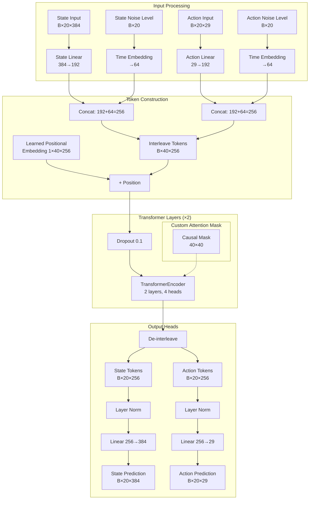
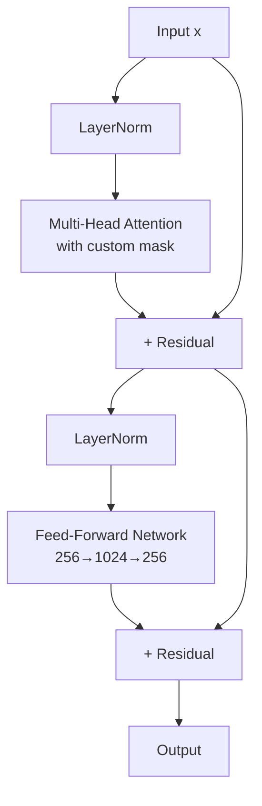

# Transformer Architecture (Co-Diffusion Transformer)

## Overview

The Co-Diffusion Transformer is the backbone neural network of DiffuseCLoC. It implements a GPT-style decoder-only transformer with custom attention masks to enable asymmetric attention patterns between states and actions.

**File**: `diffusion_policy/backbone/transformer_codiffuse.py`

**Class**: `Transformer(JointSeqBackbone)`

## Architecture Diagram



## Model Specifications

### Configuration (from `joint_diffuse.yaml`)

```yaml
backbone:
  _target_: diffusion_policy.backbone.transformer_codiffuse.Transformer
  x_horizon: 20          # State sequence length
  y_horizon: 20          # Action sequence length
  x_input_dim: 384       # State dimension
  y_input_dim: 29        # Action dimension
  x_output_dim: 384      # State output dimension
  y_output_dim: 29       # Action output dimension
  n_emb: 256             # Embedding dimension
  n_head: 4              # Number of attention heads
  n_layer: 2             # Number of transformer layers
  p_drop_emb: 0.1        # Embedding dropout
  p_drop_attn: 0.1       # Attention dropout
  causal_attn: true      # Enable custom attention masks
```

### Model Size

- **Total Parameters**: 19.95M
- **Memory Footprint**: ~80MB (FP32), ~40MB (FP16)
- **GPU Memory (Training)**: ~8GB (batch size 128)
- **GPU Memory (Inference)**: ~2GB

### Architecture Details

| Component | Configuration |
|-----------|---------------|
| Token Sequence Length | 40 (20 states + 20 actions, interleaved) |
| Embedding Dimension | 256 |
| FFN Hidden Dimension | 1024 (4 × n_emb) |
| Attention Heads | 4 |
| Head Dimension | 64 (256 / 4) |
| Transformer Layers | 2 |
| Activation Function | GELU |
| Normalization | LayerNorm (pre-norm) |
| Positional Encoding | Learned absolute |

## Token Embedding Strategy

### State Token Embedding

For each state $\boldsymbol{s}_t \in \mathbb{R}^{384}$:

$$\boldsymbol{e}_s^{(t)} = \text{Concat}(\text{Linear}_{384 \to 192}(\boldsymbol{s}_t), \text{SinEmb}_{64}(k_s^{(t)}))$$

where:
- $\text{Linear}_{384 \to 192}$: State content embedding (3/4 of total)
- $\text{SinEmb}_{64}(k_s^{(t)})$: Sinusoidal embedding of state noise level (1/4 of total)
- Final dimension: $192 + 64 = 256$

### Action Token Embedding

For each action $\boldsymbol{a}_t \in \mathbb{R}^{29}$:

$$\boldsymbol{e}_a^{(t)} = \text{Concat}(\text{Linear}_{29 \to 192}(\boldsymbol{a}_t), \text{SinEmb}_{64}(k_a^{(t)}))$$

where:
- $\text{Linear}_{29 \to 192}$: Action content embedding (3/4 of total)
- $\text{SinEmb}_{64}(k_a^{(t)})$: Sinusoidal embedding of action noise level (1/4 of total)
- Final dimension: $192 + 64 = 256$

### Rationale for 3:1 Split

- **Content (192-dim)**: Encodes the noisy state/action values
- **Noise Level (64-dim)**: Encodes the diffusion timestep
- Split ratio balances content information with conditioning on noise level

## Positional Encoding

### Learned Absolute Positional Embeddings

$$\boldsymbol{P} \in \mathbb{R}^{1 \times 40 \times 256}$$

- **Type**: Learned (not sinusoidal)
- **Initialization**: $\mathcal{N}(0, 0.02)$
- **Application**: Added to token embeddings before transformer

$$\boldsymbol{e}_{\text{pos}}^{(i)} = \boldsymbol{e}^{(i)} + \boldsymbol{P}[i] + \text{Dropout}_{0.1}(\cdot)$$

### Token Interleaving

Tokens are interleaved to create the sequence:

$$[\boldsymbol{e}_s^{(0)}, \boldsymbol{e}_a^{(0)}, \boldsymbol{e}_s^{(1)}, \boldsymbol{e}_a^{(1)}, \ldots, \boldsymbol{e}_s^{(19)}, \boldsymbol{e}_a^{(19)}]$$

**Index Mapping**:
- State tokens: indices $0, 2, 4, \ldots, 38$ (even)
- Action tokens: indices $1, 3, 5, \ldots, 39$ (odd)

## Custom Attention Mechanism

### Attention Mask Construction

The key innovation is the asymmetric attention pattern:

```python
def get_causal_mask(pattern, T1, T2):
    if pattern == 'full':
        return torch.ones((T1, T2), dtype=torch.bool)
    elif pattern == 'causal':
        return (torch.triu(torch.ones(T1, T2)) == 1).transpose(0, 1)
    elif pattern == 'no_attn':
        return torch.zeros((T1, T2), dtype=torch.bool)
```

### Mask Patterns (from config)

```yaml
x_to_x_attn: full        # States attend to all states
x_to_y_attn: no_attn     # States do NOT attend to actions
y_to_x_attn: causal      # Actions attend to past/current states
y_to_y_attn: causal      # Actions attend to past actions
```

### Visual Attention Mask (40×40)

```
      s0 a0 s1 a1 s2 a2 ...  (columns = keys)
  s0  ✓  ✗  ✓  ✗  ✓  ✗      
  a0  ✓  ✓  ✗  ✗  ✗  ✗      
  s1  ✓  ✗  ✓  ✗  ✓  ✗      
  a1  ✓  ✓  ✓  ✓  ✗  ✗      
  s2  ✓  ✗  ✓  ✗  ✓  ✗      
  a2  ✓  ✓  ✓  ✓  ✓  ✓      
  ... 
(rows = queries)

Legend:
✓ = Can attend (value = 0.0)
✗ = Cannot attend (value = -inf)
```

### Attention Computation

For each layer $\ell$, multi-head self-attention:

$$\text{Attention}(Q, K, V) = \text{softmax}\left(\frac{QK^T}{\sqrt{d_k}} + M\right)V$$

where:
- $Q, K, V \in \mathbb{R}^{B \times 40 \times 256}$
- $M \in \mathbb{R}^{40 \times 40}$ is the attention mask
- $M_{ij} = 0$ if token $i$ can attend to token $j$
- $M_{ij} = -\infty$ if token $i$ cannot attend to token $j$
- $d_k = 64$ (head dimension)

### Why This Mask Design?

**State Tokens (Full Attention)**:
- Can see all past, present, and future states
- Enables bidirectional information flow for state prediction
- Useful for planning and trajectory consistency

**Action Tokens (Causal Attention)**:
- Can only see past actions and past/current states
- Prevents using noisy future predictions
- More realistic: actions at time $t$ shouldn't depend on uncertain future

**Cross-Attention Asymmetry**:
- Actions can attend to states (y_to_x: causal)
- States do NOT attend to actions (x_to_y: no_attn)
- Rationale: Actions are control signals; states are observations

## Transformer Layer Details

### TransformerEncoderLayer Configuration

```python
decoder_layer = nn.TransformerEncoderLayer(
    d_model=256,           # Embedding dimension
    nhead=4,               # Number of heads
    dim_feedforward=1024,  # FFN hidden dimension (4×)
    dropout=0.1,           # Dropout rate
    activation='gelu',     # Activation function
    batch_first=True,      # (B, T, D) format
    norm_first=True        # Pre-norm architecture
)
```

### Layer Structure (Pre-Norm)



### Feed-Forward Network

$$\text{FFN}(x) = \text{GELU}(xW_1 + b_1)W_2 + b_2$$

where:
- $W_1 \in \mathbb{R}^{256 \times 1024}$
- $W_2 \in \mathbb{R}^{1024 \times 256}$
- GELU: Gaussian Error Linear Unit

## Output Heads

### De-Interleaving

After the transformer, tokens are de-interleaved:

- **State tokens**: indices $0, 2, 4, \ldots, 38 \to$ shape $(B, 20, 256)$
- **Action tokens**: indices $1, 3, 5, \ldots, 39 \to$ shape $(B, 20, 256)$

### State Output Head

$$\hat{\boldsymbol{s}}_t = \text{Linear}_{256 \to 384}(\text{LayerNorm}(\boldsymbol{h}_s^{(t)}))$$

- Input: $(B, 20, 256)$
- Output: $(B, 20, 384)$

### Action Output Head

$$\hat{\boldsymbol{a}}_t = \text{Linear}_{256 \to 29}(\text{LayerNorm}(\boldsymbol{h}_a^{(t)}))$$

- Input: $(B, 20, 256)$
- Output: $(B, 20, 29)$

## Sinusoidal Noise Level Embedding

**Class**: `SinusoidalPosEmb` (from `positional_embedding.py`)

### Formula

For noise level $k \in [0, K-1]$ where $K=20$:

$$\text{SinEmb}(k)_i = \begin{cases}
\sin(k \cdot \omega_i) & \text{if } i \text{ is even} \\
\cos(k \cdot \omega_i) & \text{if } i \text{ is odd}
\end{cases}$$

where:

$$\omega_i = \frac{1}{10000^{2i / d}}$$

and $d = 64$ (embedding dimension).

### Implementation

```python
class SinusoidalPosEmb(nn.Module):
    def __init__(self, dim):
        super().__init__()
        self.dim = dim

    def forward(self, x):
        device = x.device
        half_dim = self.dim // 2
        emb = math.log(10000) / (half_dim - 1)
        emb = torch.exp(torch.arange(half_dim, device=device) * -emb)
        emb = x[:, :, None] * emb[None, None, :]
        emb = torch.cat((emb.sin(), emb.cos()), dim=-1)
        return emb
```

### Shape Transformations

- Input: $k \in \mathbb{R}^{B \times T}$ (noise levels)
- Output: $\text{SinEmb}(k) \in \mathbb{R}^{B \times T \times 64}$

## Forward Pass Summary

### Input

```python
x_input: (B, 20, 384)      # State trajectory
y_input: (B, 20, 29)       # Action trajectory
x_timesteps: (B, 20)       # State noise levels k_s
y_timesteps: (B, 20)       # Action noise levels k_a
```

### Processing Steps

1. **Noise Embedding**:
   ```python
   x_time_emb = SinusoidalPosEmb(x_timesteps)  # (B, 20, 64)
   y_time_emb = SinusoidalPosEmb(y_timesteps)  # (B, 20, 64)
   ```

2. **Content Embedding**:
   ```python
   x_emb = Linear_384_to_192(x_input)  # (B, 20, 192)
   y_emb = Linear_29_to_192(y_input)   # (B, 20, 192)
   ```

3. **Concatenation**:
   ```python
   x_tokens = cat([x_emb, x_time_emb], dim=-1)  # (B, 20, 256)
   y_tokens = cat([y_emb, y_time_emb], dim=-1)  # (B, 20, 256)
   ```

4. **Interleaving**:
   ```python
   tokens = interleave(x_tokens, y_tokens)  # (B, 40, 256)
   ```

5. **Positional Encoding**:
   ```python
   tokens = Dropout(tokens + pos_emb[:, :40, :])  # (B, 40, 256)
   ```

6. **Transformer**:
   ```python
   tokens = TransformerEncoder(tokens, mask)  # (B, 40, 256)
   ```

7. **De-interleave**:
   ```python
   x_out = tokens[:, ::2, :]   # (B, 20, 256)
   y_out = tokens[:, 1::2, :]  # (B, 20, 256)
   ```

8. **Output Heads**:
   ```python
   x_output = Linear_256_to_384(LayerNorm(x_out))  # (B, 20, 384)
   y_output = Linear_256_to_29(LayerNorm(y_out))   # (B, 20, 29)
   ```

### Output

```python
x_output: (B, 20, 384)  # Predicted clean states
y_output: (B, 20, 29)   # Predicted clean actions
```

## Weight Initialization

### Linear and Embedding Layers

```python
nn.init.normal_(module.weight, mean=0.0, std=0.02)
nn.init.zeros_(module.bias)
```

### Multi-Head Attention

```python
# For in_proj_weight, q/k/v_proj_weight
nn.init.normal_(weight, mean=0.0, std=0.02)

# For biases
nn.init.zeros_(bias)
```

### LayerNorm

```python
nn.init.zeros_(module.bias)
nn.init.ones_(module.weight)
```

### Positional Embedding

```python
nn.init.normal_(pos_emb, mean=0.0, std=0.02)
```

## Optimizer Configuration

### Parameter Groups

**Decay Group** (weight decay = 0.001):
- All Linear layer weights
- All MultiheadAttention weights

**No Decay Group** (weight decay = 0.0):
- All biases
- LayerNorm parameters
- Positional embeddings

### Optimizer

```python
optimizer = torch.optim.AdamW(
    optim_groups,
    lr=1e-4,
    betas=(0.9, 0.95),
    weight_decay=0.001  # applied per group
)
```

## Computational Complexity

### Attention Complexity

For a sequence of length $T = 40$:

$$\mathcal{O}(\text{Attention}) = \mathcal{O}(T^2 \cdot d) = \mathcal{O}(40^2 \cdot 256) = \mathcal{O}(409,600)$$

### FFN Complexity

$$\mathcal{O}(\text{FFN}) = \mathcal{O}(T \cdot d \cdot 4d) = \mathcal{O}(40 \cdot 256 \cdot 1024) = \mathcal{O}(10,485,760)$$

### Total per Layer

$$\mathcal{O}(\text{Layer}) \approx \mathcal{O}(10.9M)$$

### Total for 2 Layers

$$\mathcal{O}(\text{Model}) \approx \mathcal{O}(21.8M)$$

## Comparison with Standard Transformer

| Feature | Standard Transformer | Co-Diffusion Transformer |
|---------|---------------------|--------------------------|
| **Token Type** | Single type | Dual type (state/action) |
| **Attention** | Full or causal | Custom asymmetric mask |
| **Positional Encoding** | Sinusoidal | Learned absolute |
| **Conditioning** | Cross-attention | Token embedding |
| **Architecture** | Encoder-decoder | Decoder-only |
| **Noise Level** | Single timestep | Per-token noise levels |

## Design Rationale

1. **Interleaved Tokens**: Enables direct state-action interactions via attention
2. **Asymmetric Attention**: Respects causal structure of control while allowing state planning
3. **Separate Embeddings**: Different dimensions require different transformations
4. **Noise Level in Token**: Conditions each token on its own noise level independently
5. **Pre-Norm**: More stable training than post-norm
6. **GELU Activation**: Smoother than ReLU, better for continuous predictions
