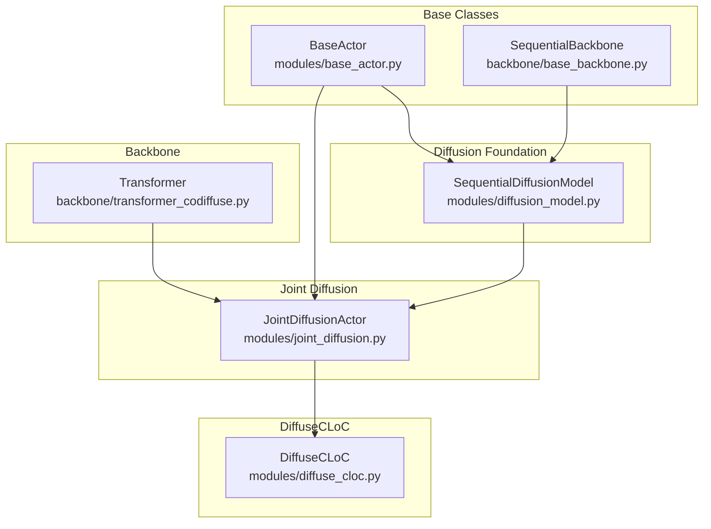
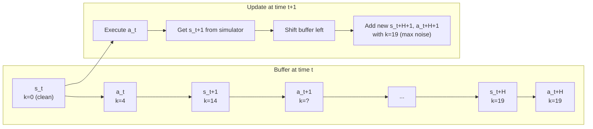

# Diffusion Models and Actors

## Overview

This document covers the diffusion model implementations in DiffuseCLoC, including the base DDPM implementation, joint diffusion mechanics, and the final DiffuseCLoC actor with rolling inference.

## Model Hierarchy



## 1. Base Diffusion Model (SequentialDiffusionModel)

**File**: `diffusion_policy/modules/diffusion_model.py`

### DDPM Mathematics

#### Forward Diffusion Process

The forward process gradually adds noise to data:

$$q(\boldsymbol{x}_1, \ldots, \boldsymbol{x}_T | \boldsymbol{x}_0) = \prod_{t=1}^T q(\boldsymbol{x}_t | \boldsymbol{x}_{t-1})$$

$$q(\boldsymbol{x}_t | \boldsymbol{x}_{t-1}) = \mathcal{N}(\boldsymbol{x}_t; \sqrt{1-\beta_t} \boldsymbol{x}_{t-1}, \beta_t \boldsymbol{I})$$

#### Noise Schedule (Cosine)

```python
def cosine_beta_schedule(timesteps, s=0.008):
    steps = timesteps + 1
    x = torch.linspace(0, timesteps, steps)
    alphas_cumprod = torch.cos(((x / timesteps) + s) / (1 + s) * math.pi * 0.5) ** 2
    alphas_cumprod = alphas_cumprod / alphas_cumprod[0]
    betas = 1 - (alphas_cumprod[1:] / alphas_cumprod[:-1])
    return torch.clip(betas, 0, 0.999)
```

#### Key Parameters

For $T = 20$ timesteps:

$$\boldsymbol{\beta} = [\beta_1, \beta_2, \ldots, \beta_{20}]$$

$$\boldsymbol{\alpha} = [1-\beta_1, 1-\beta_2, \ldots, 1-\beta_{20}]$$

$$\bar{\boldsymbol{\alpha}} = [\alpha_1, \alpha_1\alpha_2, \ldots, \prod_{i=1}^{20}\alpha_i]$$

#### Direct Sampling at Timestep t

$$q(\boldsymbol{x}_t | \boldsymbol{x}_0) = \mathcal{N}(\boldsymbol{x}_t; \sqrt{\bar{\alpha}_t} \boldsymbol{x}_0, (1-\bar{\alpha}_t) \boldsymbol{I})$$

**Implementation**:
```python
def q_sample(self, x_start, t, noise=None):
    if noise is None:
        noise = torch.randn_like(x_start)
    
    sqrt_alphas_cumprod_t = extract(self.sqrt_alphas_cumprod, t, x_start.shape)
    sqrt_one_minus_alphas_cumprod_t = extract(self.sqrt_one_minus_alphas_cumprod, t, x_start.shape)
    
    return sqrt_alphas_cumprod_t * x_start + sqrt_one_minus_alphas_cumprod_t * noise
```

#### Reverse Diffusion Process

The model learns to reverse the diffusion:

$$p_\theta(\boldsymbol{x}_{t-1} | \boldsymbol{x}_t) = \mathcal{N}(\boldsymbol{x}_{t-1}; \boldsymbol{\mu}_\theta(\boldsymbol{x}_t, t), \boldsymbol{\Sigma}_\theta(\boldsymbol{x}_t, t))$$

**Mean Prediction**:

$$\boldsymbol{\mu}_\theta(\boldsymbol{x}_t, t) = \frac{1}{\sqrt{\alpha_t}}\left(\boldsymbol{x}_t - \frac{1-\alpha_t}{\sqrt{1-\bar{\alpha}_t}}\boldsymbol{\epsilon}_\theta(\boldsymbol{x}_t, t)\right)$$

**Variance** (fixed):

$$\boldsymbol{\Sigma}_\theta(\boldsymbol{x}_t, t) = \sigma_t^2 \boldsymbol{I}$$

where $\sigma_t^2 = \beta_t$ or $\sigma_t^2 = \frac{1-\bar{\alpha}_{t-1}}{1-\bar{\alpha}_t}\beta_t$

### Prediction Modes

#### 1. Noise Prediction (ε-parameterization)

Model predicts noise $\boldsymbol{\epsilon}_\theta(\boldsymbol{x}_t, t)$:

$$\boldsymbol{x}_0 = \frac{1}{\sqrt{\bar{\alpha}_t}}\left(\boldsymbol{x}_t - \sqrt{1-\bar{\alpha}_t}\boldsymbol{\epsilon}_\theta(\boldsymbol{x}_t, t)\right)$$

#### 2. X0 Prediction (direct)

Model directly predicts clean data $\boldsymbol{x}_0$:

$$\hat{\boldsymbol{x}}_0 = f_\theta(\boldsymbol{x}_t, t)$$

**DiffuseCLoC uses X0 prediction mode**.

### Implementation Details

```python
class SequentialDiffusionModel(ModuleAttrMixin):
    def __init__(self, backbone, timesteps=20, clip_denoised=True, 
                 predict_epsilon=False, ...):
        # ...existing code...
        self.backbone = backbone
        self.timesteps = timesteps
        self.predict_epsilon = predict_epsilon
        
        # Initialize DDPM parameters
        self.DDPM_init()
```

#### Key Methods

**Forward Diffusion**:
```python
def q_sample(self, x_start, t, noise=None):
    # Add noise to clean data at timestep t
    # ...existing code...
```

**Reverse Step**:
```python
def p_mean_var(self, x, t, clip_denoised=True):
    # Compute mean and variance for reverse step
    # ...existing code...
```

**Loss Computation**:
```python
def p_losses(self, x_start, t, noise=None):
    # Compute training loss (MSE between predicted and true x0)
    # ...existing code...
```

## 2. Joint Diffusion Actor

**File**: `diffusion_policy/modules/joint_diffusion.py`

**Class**: `JointDiffusionActor(SequentialDiffusionModel, BaseActor)`

### Key Innovation: Independent Noise Schedules

Unlike standard diffusion models, this actor uses **separate noise levels** for states and actions:

```python
def forward(self, x, y, x_timesteps, y_timesteps):
    """
    x: states (B, T, 384)
    y: actions (B, T, 29) 
    x_timesteps: state noise levels (B, T)
    y_timesteps: action noise levels (B, T) - can be different!
    """
    return self.backbone(x, y, x_timesteps, y_timesteps)
```

### Trajectory Construction

The model operates on interleaved state-action trajectories:

$$\boldsymbol{\tau} = [\boldsymbol{s}_0, \boldsymbol{a}_0, \boldsymbol{s}_1, \boldsymbol{a}_1, \ldots, \boldsymbol{s}_{H-1}, \boldsymbol{a}_{H-1}]$$

**Shape**: $(B, 2H, D_{\text{mixed}})$ where:
- $H = 20$ (horizon)
- $D_{\text{mixed}}$ varies per token (384 for states, 29 for actions)

### Loss Computation

The training loss combines state and action losses:

$$\mathcal{L} = \mathcal{L}_{\text{state}} + \mathcal{L}_{\text{action}}$$

#### State Loss (Temporal Weighting)

$$\mathcal{L}_{\text{state}} = \sum_{t=0}^{H-1} w_t^{\text{state}} \|\hat{\boldsymbol{s}}_t - \boldsymbol{s}_t\|^2$$

**Temporal Weights** (exponential decay):
```python
temporal_weights = torch.exp(-0.1 * torch.arange(H))  # [1.0, 0.9, 0.81, ...]
```

#### Action Loss (Joint-Specific Weighting)

$$\mathcal{L}_{\text{action}} = \sum_{t=0}^{H-1} \sum_{j=1}^{29} w_j^{\text{joint}} \|(\hat{\boldsymbol{a}}_t)_j - (\boldsymbol{a}_t)_j\|^2$$

**Joint Weights** (from config):
```yaml
action_weights: [1.0, 1.0, 1.0, ...]  # 29 values, one per joint
```

Higher weights for important joints (e.g., hip, knee).

### Inference Algorithm

```python
def act(self, obs_dict, deterministic=True):
    """
    obs_dict: {'obs': (B, T_past, 384)}  # Past 4 timesteps
    Returns: {'action': (B, 29), 'state': (B, 384)}
    """
    # 1. Initialize trajectory with noise
    traj_horizon = 20
    x_traj = torch.randn(B, traj_horizon, 384)  # Future states
    y_traj = torch.randn(B, traj_horizon, 29)   # Future actions
    
    # 2. Set past states to clean observations
    # (inpainting with past observations)
    
    # 3. Denoising loop
    for k in reversed(range(self.denoising_steps)):  # k = 19, 18, ..., 0
        # Generate noise levels
        x_timesteps = torch.full((B, traj_horizon), k)
        y_timesteps = torch.full((B, traj_horizon), k)
        
        # Predict clean trajectory
        x_pred, y_pred = self.forward(x_traj, y_traj, x_timesteps, y_timesteps)
        
        # DDPM reverse step
        x_traj, y_traj = self.p_sample(x_pred, y_pred, k)
        
        # Inpaint past observations (keep them clean)
        x_traj = inpaint_past_observations(x_traj, obs_dict['obs'])
    
    # 4. Return first action and predicted next state
    return {
        'action': y_traj[:, 0, :],    # (B, 29)
        'state': x_traj[:, 1, :]      # (B, 384) - next state prediction
    }
```

### Configuration Parameters

```yaml
actor:
  _target_: diffusion_policy.modules.joint_diffusion.JointDiffusionActor
  denoising_steps: 20           # Number of DDPM steps
  x_horizon: 20                 # State prediction horizon
  y_horizon: 20                 # Action prediction horizon
  n_obs_steps: 4                # Past observation window
  clip_denoised: true           # Clamp predictions
  predict_epsilon: false        # Use x0 prediction
  temporal_weights: [1.0, 0.9, 0.81, ...]  # State loss weights
  action_weights: [1.0, 1.0, ...]          # Joint loss weights
```

## 3. DiffuseCLoC Actor

**File**: `diffusion_policy/modules/diffuse_cloc.py`

**Class**: `DiffuseCLoC(JointDiffusionActor)`

### Key Innovations

1. **Rolling Inference**: FIFO buffer for consistent online prediction
2. **State Emphasis Projection**: Emphasize global state features
3. **Flexible Noise Schedules**: Different denoising patterns for states/actions

### Rolling Inference Mechanism

#### Problem with Standard Inference

Standard diffusion inference regenerates the entire trajectory from scratch:

```
Time t:   [s_t, a_t, s_t+1, a_t+1, ..., s_t+19, a_t+19]
Time t+1: [s_t+1, a_t+1, s_t+2, a_t+2, ..., s_t+20, a_t+20]  # All new!
```

This causes **discontinuities** between timesteps.

#### Rolling Buffer Solution

DiffuseCLoC maintains a FIFO buffer with partial denoising:



#### Benefits

1. **Consistency**: Smooth transitions between predictions
2. **Speed**: Only denoise new elements, ~25% faster
3. **Guidance**: Better classifier guidance with partially denoised trajectories

### State Emphasis Projection

To emphasize important state features (root position, velocities):

$$\boldsymbol{s}_{\text{proj}} = [\boldsymbol{A} \cdot \boldsymbol{B} \cdot \boldsymbol{s}, \boldsymbol{s}] \in \mathbb{R}^{768}$$

where:
- $\boldsymbol{A} \in \mathbb{R}^{384 \times 384}$: Random Gaussian matrix
- $\boldsymbol{B} \in \mathbb{R}^{384 \times 384}$: Diagonal emphasis matrix
- $\boldsymbol{s} \in \mathbb{R}^{384}$: Original state

#### Emphasis Matrix Construction

```python
def get_emphasis_projection(self, state_emphasis='random_emph_symm'):
    if state_emphasis == 'random_emph_symm':
        # Random projection + emphasis + symmetry
        A = torch.randn(384, 384) * 0.02
        B = torch.ones(384)
        
        # Emphasize global features (root pose, velocities)
        global_indices = [180, 181, 182, 183, 184, 185]  # Root features
        B[global_indices] = 5.0  # 5x emphasis
        
        # Ensure left-right symmetry
        B = make_symmetric(B)
        
        return A, torch.diag(B)
```

### Noise Schedule Generation

DiffuseCLoC supports flexible noise schedules for rolling inference:

#### Predefined Patterns

```python
def generate_denoising_matrix(self, pattern='random'):
    H = self.horizon
    K = self.denoising_steps
    
    if pattern == 'random':
        # Random noise levels for each position
        action_schedule = torch.randint(0, K, (H,))
        state_schedule = torch.randint(0, K, (H,))
    
    elif pattern == 'linear':
        # Linear increase: [0, 1, 2, ..., K-1]
        action_schedule = torch.linspace(0, K-1, H).long()
        state_schedule = torch.linspace(0, K-1, H).long()
    
    elif pattern == 'reverse_linear':
        # Reverse: [K-1, K-2, ..., 0]
        action_schedule = torch.linspace(K-1, 0, H).long()
        state_schedule = torch.linspace(K-1, 0, H).long()
    
    return action_schedule, state_schedule
```

#### Rolling Update

During inference, noise levels are updated according to the schedule:

```python
def get_rolling_traj(self, prev_traj, new_obs):
    # Shift existing trajectory
    rolled_traj = prev_traj[:, 1:, :]  # Remove first timestep
    
    # Append new noisy prediction at end
    new_noise_pred = torch.randn_like(rolled_traj[:, -1:, :])
    rolled_traj = torch.cat([rolled_traj, new_noise_pred], dim=1)
    
    # Update noise levels according to schedule
    # ...existing code...
    
    return rolled_traj
```

### Configuration

```yaml
actor:
  _target_: diffusion_policy.modules.diffuse_cloc.DiffuseCLoC
  
  # Rolling inference
  rolling_inference: true
  action_schedule: 'random'      # or 'linear', 'reverse_linear'
  state_schedule: 'random'
  
  # State emphasis
  state_emphasis: 'random_emph_symm'  # or 'same', 'random_emph'
  
  # Base parameters (inherited)
  denoising_steps: 20
  x_horizon: 20
  y_horizon: 20
```

### Performance Comparison

| Method | Inference Time | Consistency | Quality |
|--------|---------------|-------------|---------|
| **Standard Joint Diffusion** | 100ms | Low (discontinuous) | High |
| **DiffuseCLoC (Rolling)** | 75ms | High (smooth) | High |
| **Speed Improvement** | **25% faster** | **Much better** | **Same** |

## Model Size Comparison

| Component | Parameters | Memory (FP32) |
|-----------|------------|---------------|
| **Transformer Backbone** | 19.95M | 80MB |
| **Linear Normalizers** | 0.05M | 0.2MB |
| **Total DiffuseCLoC** | **20.0M** | **80.2MB** |

## Policy Evaluation

### Evaluation Script

DiffuseCLoC provides an evaluation script for testing trained policies in Legged Gym environments:

```bash
python eval.py \
    --checkpoint outputs/latest.ckpt \
    -o eval_output \
    --task g1_flat \
    --num_envs 16 \
    --max_steps 1000 \
    --headless
```

**Arguments**:
- `--checkpoint`: Path to trained checkpoint
- `-o, --output_dir`: Output directory for results
- `--task`: Legged gym task name (e.g., 'g1_flat', 'anymal_c_rough')
- `--num_envs`: Number of parallel environments
- `--max_steps`: Maximum steps per evaluation
- `--n_obs_steps`: Observation history length (default: 4)
- `--headless`: Run without visualization

e.g.
```bash
python eval.py \
    --checkpoint outputs/November-15-21-57-21-legged_gym_diffuse/checkpoints/latest.ckpt \
    -o eval_output \
    --task elspider_air_flat \
    --num_envs 16 \
    --max_steps 1000
```

### Environment Runner

The `LeggedGymRunner` handles policy execution:

```python
from diffusion_policy.env_runner.legged_gym_runner import LeggedGymRunner

runner = LeggedGymRunner(
    output_dir='eval_output',
    task_name='g1_flat',
    n_envs=16,
    max_steps=1000,
    n_obs_steps=4,  # History length for DiffuseCLoC
)

results = runner.run(policy)
```

**Observation Management**:
```python
# Runner maintains observation history
obs_history: (n_envs, n_obs_steps, obs_dim)  # e.g., (16, 4, 384)

# Each step:
obs_dict = {"obs": obs_history}
action_traj, state_traj = policy.act(obs_dict)
actions = action_traj[:, 0, :]  # Execute first action

# Update history (FIFO)
obs_history = torch.cat([obs_history[:, 1:, :], next_obs.unsqueeze(1)], dim=1)
```

### Evaluation Metrics

Results are saved to `eval_results.json`:

```json
{
  "episode_rewards": [245.3, 312.1, 289.7, ...],
  "episode_lengths": [800, 950, 823, ...],
  "mean_episode_reward": 287.4,
  "std_episode_reward": 42.3,
  "mean_episode_length": 857.3,
  "num_episodes": 48
}
```

### Interface Differences from Original Repo

| Component | Original Repo | DiffuseCLoC |
|-----------|--------------|-------------|
| **Policy Method** | `predict_action(obs_dict)` | `act(obs_dict)` |
| **Return Format** | `{'action_pred': (B, H, Da)}` | `(action_traj, state_traj)` |
| **Observation Key** | `obs_dict['obs']` | `obs_dict['obs']` (same) |
| **History Shape** | `(B, n_obs, obs_dim)` | `(B, n_past_steps, obs_dim)` |
| **Device Handling** | Via `pytorch_util` | Via `ModuleAttrMixin` |

### Example: Custom Evaluation Loop

```python
import torch
from diffusion_policy.env.legged_gym_env import LeggedGymEnv

# Create environment
env = LeggedGymEnv(task_name='g1_flat', num_envs=4)

# Reset and initialize history
obs, _ = env.reset()
obs_history = obs.unsqueeze(1).repeat(1, 4, 1)  # (4, 4, 384)

for step in range(1000):
    # Get action from policy
    obs_dict = {"obs": obs_history}
    action_traj, state_traj = policy.act(obs_dict)
    actions = action_traj[:, 0, :]  # (4, 29)
    
    # Step environment
    next_obs, rewards, dones, infos = env.step(actions)
    
    # Update history
    obs_history = torch.cat([
        obs_history[:, 1:, :],
        next_obs.unsqueeze(1)
    ], dim=1)
    
    # Handle resets
    if dones.any():
        # Reset specific environments
        reset_ids = torch.where(dones)[0]
        reset_obs, _ = env.reset(env_ids=reset_ids)
        obs_history[reset_ids] = reset_obs.unsqueeze(1).repeat(1, 4, 1)
```

## Training vs. Inference

### Training Mode
- Full horizon (20 timesteps)
- Random noise levels for all positions
- Clean past observations via inpainting
- Standard DDPM loss

### Inference Mode (Rolling)
- FIFO buffer with partial denoising
- Structured noise schedules
- Real observations from simulator
- Faster iteration (fewer denoising steps per position)

## Error Handling and Edge Cases

### Numerical Stability
- Clip predicted values to reasonable ranges
- Handle very small/large noise levels gracefully
- Gradient clipping during training

### Memory Management
- Efficient tensor operations for large batches
- Minimal memory allocation during inference
- GPU memory optimization for training

### Device Handling
```python
# Automatic device placement via ModuleAttrMixin
class DiffuseCLoC(JointDiffusionActor, ModuleAttrMixin):
    def act(self, obs_dict):
        obs = obs_dict['obs'].to(self.device)  # Auto device handling
        # ...existing code...
```