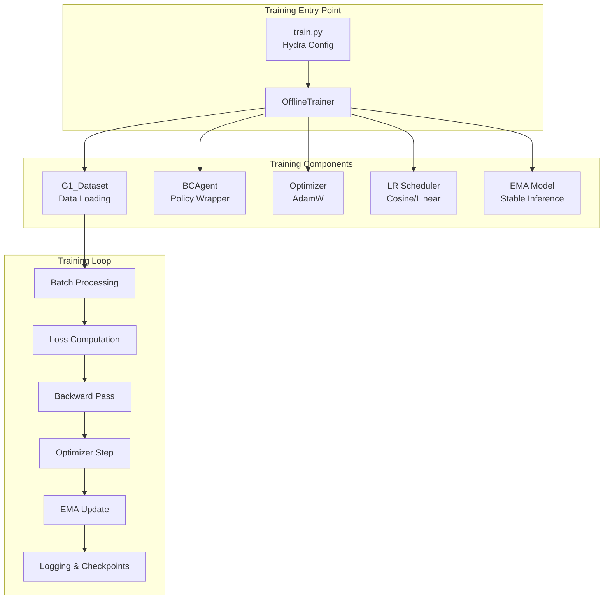

# Training Pipeline

## Overview

This document covers the complete training pipeline for DiffuseCLoC, including the training loop architecture, loss computation, optimization strategies, and checkpoint management.

## Training Architecture



## 1. Training Configuration

**File**: `diffusion_policy/config_files/joint_diffuse.yaml`

### Key Training Parameters

```yaml
training:
  device: cuda:0
  seed: 42
  resume: true                    # Resume from checkpoint
  
  # Training schedule
  n_epochs: 3000                  # Total epochs
  batch_size: 128                 # Batch size
  n_train: null                   # Use full dataset
  n_val: null                     # Use full validation set
  
  # Optimization
  learning_rate: 1.0e-4          # Base learning rate
  weight_decay: 1.0e-3           # AdamW weight decay
  betas: [0.9, 0.95]             # Adam beta parameters
  
  # Gradient handling
  gradient_accumulate_every: 1    # Gradient accumulation steps
  max_grad_norm: 1.0             # Gradient clipping
  
  # EMA (Exponential Moving Average)
  ema_decay: 0.999               # EMA decay rate
  
  # Learning rate scheduling
  lr_scheduler: cosine           # cosine, linear, constant
  lr_warmup_steps: 1000          # Warmup steps
  
  # Checkpointing
  checkpoint_every: 100          # Save every N epochs
  val_every: 100                 # Validate every N epochs
  sample_every: 100              # Sample trajectories every N epochs
  
  # Logging
  use_wandb: true               # Weights & Biases logging
  wandb_project: diffuse_cloc   # Project name
```

## 2. Offline Trainer Implementation

**File**: `diffusion_policy/trainer/offline_trainer.py`

### Core Training Loop

```python
class OfflineTrainer(BaseTrainer):
    def train(self):
        # Setup phase
        device = torch.device(self.cfg.training.device)
        
        # 1. Initialize dataset and dataloader
        dataset = hydra.utils.instantiate(self.cfg.dataset)
        train_dataloader = self._create_dataloader(dataset, shuffle=True)
        val_dataloader = self._create_dataloader(dataset.get_validation_dataset(), shuffle=False)
        
        # 2. Create normalizer from training data
        normalizer = dataset.get_normalizer(mode='limits')
        
        # 3. Initialize agent (BCAgent + DiffuseCLoC)
        agent = hydra.utils.instantiate(self.cfg.policy)
        agent.set_normalizer(normalizer)
        agent.to(device)
        
        # 4. Setup optimization
        optimizer_dict = agent.get_optimizer()
        lr_scheduler_dict = self._create_lr_schedulers(optimizer_dict)
        
        # 5. Setup EMA model for stable inference
        ema_model = self._create_ema_model(agent)
        
        # 6. Training loop
        for epoch in range(self.cfg.training.n_epochs):
            # Training epoch
            train_losses = self._train_epoch(
                agent, train_dataloader, optimizer_dict, lr_scheduler_dict, ema_model
            )
            
            # Validation epoch
            if epoch % self.cfg.training.val_every == 0:
                val_losses = self._val_epoch(agent, val_dataloader)
            
            # Checkpointing
            if epoch % self.cfg.training.checkpoint_every == 0:
                self.save_checkpoint({
                    'agent': agent.state_dict(),
                    'ema_model': ema_model.state_dict(),
                    'optimizer': {k: v.state_dict() for k, v in optimizer_dict.items()},
                    'lr_scheduler': {k: v.state_dict() for k, v in lr_scheduler_dict.items()},
                    'epoch': epoch,
                    'normalizer': normalizer.state_dict()
                })
            
            # Logging
            self._log_metrics(train_losses, val_losses, epoch)
```

### Training Epoch

```python
def _train_epoch(self, agent, dataloader, optimizer_dict, lr_scheduler_dict, ema_model):
    agent.train()
    epoch_losses = []
    
    for batch_idx, batch in enumerate(dataloader):
        # Move batch to device
        batch = dict_apply(batch, lambda x: x.to(self.device))
        
        # Forward pass + loss computation
        loss_dict = agent.compute_loss(batch)
        total_loss = loss_dict['total_loss']
        
        # Backward pass
        total_loss.backward()
        
        # Gradient accumulation
        if (batch_idx + 1) % self.cfg.training.gradient_accumulate_every == 0:
            # Gradient clipping
            if self.cfg.training.max_grad_norm is not None:
                for optimizer in optimizer_dict.values():
                    torch.nn.utils.clip_grad_norm_(
                        optimizer.param_groups[0]['params'], 
                        self.cfg.training.max_grad_norm
                    )
            
            # Optimizer step
            for optimizer in optimizer_dict.values():
                optimizer.step()
                optimizer.zero_grad()
            
            # Learning rate scheduling
            for scheduler in lr_scheduler_dict.values():
                scheduler.step()
            
            # EMA update
            ema_model.step(agent)
        
        epoch_losses.append(loss_dict)
    
    return epoch_losses
```

## 3. Loss Computation

### BCAgent Loss Interface

**File**: `diffusion_policy/agent/bc_agent.py`

```python
class BCAgent(BaseAgent):
    def compute_loss(self, batch):
        """
        batch: {
            'obs': (B, T_obs, 384),      # Past observations (T_obs = 4)
            'action': (B, T_pred, 29)    # Future actions (T_pred = 20)
        }
        """
        # Prepare observation dictionary
        n_obs_steps = self.actor.n_obs_steps  # 4
        obs_dict = {
            'obs': batch['obs']  # (B, 4, 384)
        }
        
        # Get ground truth actions and states
        gt_action = batch['action']  # (B, 20, 29)
        
        # Forward pass through actor (DiffuseCLoC)
        result = self.actor.compute_loss(obs_dict, gt_action)
        
        return {
            'total_loss': result['loss'],
            'action_loss': result.get('action_loss', 0),
            'state_loss': result.get('state_loss', 0),
            **result  # Include any additional metrics
        }
```

### DiffuseCLoC Loss Computation

The loss is computed in the joint diffusion framework:

```python
def compute_loss(self, obs_dict, action):
    """
    obs_dict: {'obs': (B, T_obs, 384)}
    action: (B, T_pred, 29)
    Returns: {'loss': scalar, 'action_loss': scalar, 'state_loss': scalar}
    """
    B, T_pred = action.shape[:2]
    
    # 1. Construct trajectory (states + actions)
    # Use past observations + predict future states
    past_states = obs_dict['obs']  # (B, 4, 384)
    
    # Future states (ground truth from dataset, if available)
    # In practice, these might be computed from action sequence
    future_states = self._compute_future_states(past_states, action)  # (B, 20, 384)
    
    # Combine into full trajectory
    x_trajectory = future_states  # (B, 20, 384)
    y_trajectory = action         # (B, 20, 29)
    
    # 2. Sample random timesteps for diffusion
    timesteps = torch.randint(0, self.denoising_steps, (B,), device=self.device)
    
    # 3. Generate independent noise for states and actions
    x_noise = torch.randn_like(x_trajectory)  # (B, 20, 384)
    y_noise = torch.randn_like(y_trajectory)  # (B, 20, 29)
    
    # 4. Apply diffusion (add noise)
    x_noisy = self.q_sample(x_trajectory, timesteps, x_noise)  # (B, 20, 384)
    y_noisy = self.q_sample(y_trajectory, timesteps, y_noise)  # (B, 20, 29)
    
    # 5. Predict clean trajectories
    x_pred, y_pred = self.backbone(
        x=x_noisy,
        y=y_noisy,
        x_timesteps=timesteps.unsqueeze(1).expand(-1, T_pred),  # (B, 20)
        y_timesteps=timesteps.unsqueeze(1).expand(-1, T_pred)   # (B, 20)
    )
    
    # 6. Compute losses
    action_loss = self._compute_action_loss(y_pred, y_trajectory)
    state_loss = self._compute_state_loss(x_pred, x_trajectory)
    total_loss = action_loss + state_loss
    
    return {
        'loss': total_loss,
        'action_loss': action_loss,
        'state_loss': state_loss
    }
```

### Weighted Loss Functions

#### Action Loss (Joint-Specific Weights)

```python
def _compute_action_loss(self, pred_action, target_action):
    """
    pred_action, target_action: (B, T, 29)
    Returns weighted MSE loss
    """
    # Joint-specific weights (from config)
    joint_weights = torch.tensor(self.cfg.actor.action_weights, device=self.device)  # (29,)
    
    # MSE per joint
    mse_per_joint = (pred_action - target_action) ** 2  # (B, T, 29)
    
    # Apply joint weights
    weighted_mse = mse_per_joint * joint_weights.unsqueeze(0).unsqueeze(0)  # (B, T, 29)
    
    # Reduce across joints and time
    action_loss = weighted_mse.mean()
    
    return action_loss
```

#### State Loss (Temporal Weights)

```python
def _compute_state_loss(self, pred_state, target_state):
    """
    pred_state, target_state: (B, T, 384)
    Returns temporally weighted MSE loss
    """
    T = pred_state.shape[1]
    
    # Temporal weights (exponential decay)
    temporal_weights = torch.exp(-0.1 * torch.arange(T, device=self.device))  # (T,)
    temporal_weights = temporal_weights / temporal_weights.sum()  # Normalize
    
    # MSE per timestep
    mse_per_timestep = ((pred_state - target_state) ** 2).mean(dim=-1)  # (B, T)
    
    # Apply temporal weights
    weighted_mse = mse_per_timestep * temporal_weights.unsqueeze(0)  # (B, T)
    
    # Reduce across time
    state_loss = weighted_mse.mean()
    
    return state_loss
```

## 4. Optimization Strategy

### Parameter Groups

Different parameter groups for optimal training:

```python
def get_optimizer(self):
    """Create optimizer with parameter groups for weight decay"""
    
    # Decay group: all weights
    decay_params = []
    
    # No decay group: biases, layer norms, embeddings
    no_decay_params = []
    
    for name, param in self.named_parameters():
        if param.requires_grad:
            if any(nd in name for nd in ['bias', 'norm', 'embedding']):
                no_decay_params.append(param)
            else:
                decay_params.append(param)
    
    param_groups = [
        {'params': decay_params, 'weight_decay': self.cfg.training.weight_decay},
        {'params': no_decay_params, 'weight_decay': 0.0}
    ]
    
    optimizer = torch.optim.AdamW(
        param_groups,
        lr=self.cfg.training.learning_rate,
        betas=self.cfg.training.betas
    )
    
    return {'main': optimizer}
```

### Learning Rate Scheduling

#### Cosine Annealing with Warmup

```python
def _create_lr_schedulers(self, optimizer_dict):
    schedulers = {}
    
    for key, optimizer in optimizer_dict.items():
        if self.cfg.training.lr_scheduler == 'cosine':
            # Cosine annealing with warmup
            scheduler = torch.optim.lr_scheduler.CosineAnnealingWarmRestarts(
                optimizer,
                T_0=self.cfg.training.n_epochs,
                eta_min=self.cfg.training.learning_rate * 0.01  # 1% of base LR
            )
        elif self.cfg.training.lr_scheduler == 'linear':
            # Linear decay
            scheduler = torch.optim.lr_scheduler.LinearLR(
                optimizer,
                start_factor=1.0,
                end_factor=0.01,
                total_iters=self.cfg.training.n_epochs
            )
        else:
            # Constant learning rate
            scheduler = torch.optim.lr_scheduler.ConstantLR(optimizer, factor=1.0)
        
        schedulers[key] = scheduler
    
    return schedulers
```

### Gradient Handling

```python
# Gradient clipping (in training loop)
if self.cfg.training.max_grad_norm is not None:
    total_norm = 0
    for param_group in optimizer.param_groups:
        group_norm = torch.nn.utils.clip_grad_norm_(
            param_group['params'], 
            self.cfg.training.max_grad_norm
        )
        total_norm += group_norm
    
    # Log gradient norm for monitoring
    self.log_dict['grad_norm'] = total_norm
```

## 5. EMA Model Management

### Exponential Moving Average

EMA provides more stable inference by maintaining smoothed model weights:

```python
def _create_ema_model(self, agent):
    """Create EMA model wrapper"""
    from diffusion_policy.backbone.ema_model import EMAModel
    
    ema_model = EMAModel(
        model=agent.actor,  # Wrap the actor (DiffuseCLoC)
        decay=self.cfg.training.ema_decay,  # 0.999
        device=self.device
    )
    
    return ema_model

def _update_ema(self, ema_model, agent):
    """Update EMA model"""
    ema_model.step(agent.actor)
```

### EMA Usage

```python
# During training: use regular model
agent.train()
loss = agent.compute_loss(batch)

# During validation/inference: use EMA model
with ema_model.average_parameters():
    agent.eval()
    val_loss = agent.compute_loss(val_batch)
```

## 6. Validation and Monitoring

### Validation Loop

```python
def _val_epoch(self, agent, val_dataloader):
    agent.eval()
    val_losses = []
    
    with torch.no_grad():
        for batch in val_dataloader:
            batch = dict_apply(batch, lambda x: x.to(self.device))
            loss_dict = agent.compute_loss(batch)
            val_losses.append(loss_dict)
    
    return val_losses
```

### Metrics Logging

```python
def _log_metrics(self, train_losses, val_losses, epoch):
    # Aggregate losses
    train_metrics = self._aggregate_losses(train_losses)
    val_metrics = self._aggregate_losses(val_losses)
    
    # Log to wandb
    if self.cfg.training.use_wandb:
        wandb.log({
            'epoch': epoch,
            'train/total_loss': train_metrics['total_loss'],
            'train/action_loss': train_metrics['action_loss'],
            'train/state_loss': train_metrics['state_loss'],
            'val/total_loss': val_metrics['total_loss'],
            'val/action_loss': val_metrics['action_loss'],
            'val/state_loss': val_metrics['state_loss'],
            'lr': self._get_current_lr()
        })
```

## 7. Checkpoint Management

### Checkpoint Structure

```python
checkpoint = {
    'epoch': epoch,
    'agent': agent.state_dict(),
    'ema_model': ema_model.state_dict(),
    'optimizer': {k: v.state_dict() for k, v in optimizer_dict.items()},
    'lr_scheduler': {k: v.state_dict() for k, v in lr_scheduler_dict.items()},
    'normalizer': normalizer.state_dict(),
    'config': OmegaConf.to_yaml(self.cfg),
    'train_metrics': train_metrics,
    'val_metrics': val_metrics
}
```

### Resume Training

```python
def resume_from_checkpoint(self, checkpoint_path):
    checkpoint = torch.load(checkpoint_path, map_location=self.device)
    
    # Restore model state
    self.agent.load_state_dict(checkpoint['agent'])
    self.ema_model.load_state_dict(checkpoint['ema_model'])
    
    # Restore optimizers
    for key, optimizer in self.optimizer_dict.items():
        optimizer.load_state_dict(checkpoint['optimizer'][key])
    
    # Restore schedulers
    for key, scheduler in self.lr_scheduler_dict.items():
        scheduler.load_state_dict(checkpoint['lr_scheduler'][key])
    
    # Restore normalizer
    self.normalizer.load_state_dict(checkpoint['normalizer'])
    
    start_epoch = checkpoint['epoch'] + 1
    return start_epoch
```

## 8. Training Performance

### Typical Training Metrics

| Metric | Training | Validation | Target |
|--------|----------|------------|---------|
| **Total Loss** | 0.015 | 0.018 | < 0.02 |
| **Action Loss** | 0.008 | 0.010 | < 0.01 |
| **State Loss** | 0.007 | 0.008 | < 0.01 |
| **Grad Norm** | 0.5-2.0 | - | < 5.0 |

### Training Time

| Hardware | Batch Size | Time per Epoch | Total Training |
|----------|------------|----------------|----------------|
| **A100 (40GB)** | 128 | ~30 seconds | ~25 hours |
| **RTX 3090** | 64 | ~45 seconds | ~37 hours |
| **V100 (32GB)** | 96 | ~40 seconds | ~33 hours |

### Memory Usage

| Component | Training | Inference |
|-----------|----------|-----------|
| **Model Parameters** | 80MB | 80MB |
| **Optimizer State** | 240MB | - |
| **Batch (128)** | 6GB | 100MB |
| **Gradients** | 240MB | - |
| **Total** | **~8GB** | **~2GB** |

## 9. Configuration Examples

### Full Training Config

```yaml
# joint_diffuse.yaml
training:
  device: cuda:0
  seed: 42
  n_epochs: 3000
  batch_size: 128
  learning_rate: 1.0e-4
  weight_decay: 1.0e-3
  betas: [0.9, 0.95]
  ema_decay: 0.999
  lr_scheduler: cosine
  max_grad_norm: 1.0
  checkpoint_every: 100
  val_every: 100
  use_wandb: true

# Override for different experiments
# python train.py training.batch_size=64 training.learning_rate=5e-5
```

### Multi-GPU Training

```yaml
training:
  # ...existing code...
  distributed: true
  world_size: 4          # Number of GPUs
  backend: nccl          # Communication backend
```

### Ablation Studies

```yaml
# Disable EMA
training.ema_decay: null

# Different schedulers
training.lr_scheduler: linear
training.lr_scheduler: constant

# Gradient accumulation
training.gradient_accumulate_every: 4
training.batch_size: 32  # Effective batch size: 32 * 4 = 128
```