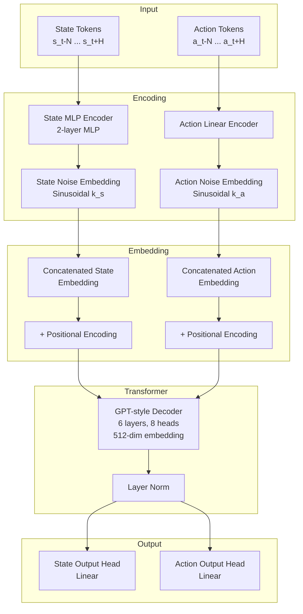
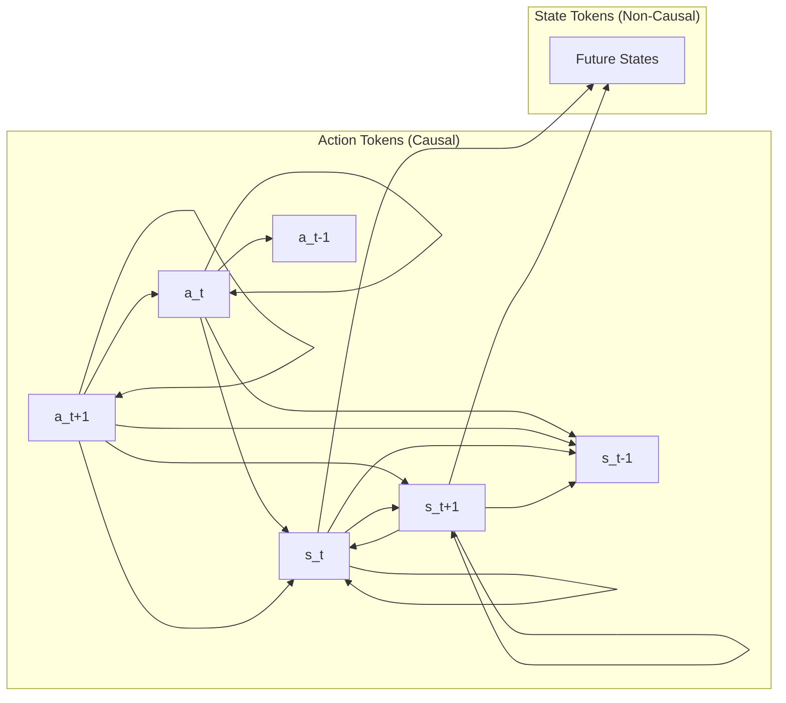
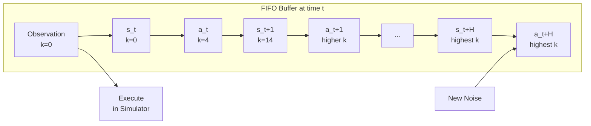

# Diffuse-CLoC Co-Diffusion Architecture

## Overview

Diffuse-CLoC co-diffuses states and actions within a single diffusion model to enable guided physics-based character control. This allows action generation to be conditioned on predicted states, bridging the gap between kinematic motion diffusion and action diffusion models.

## Core Mathematical Framework

### Trajectory Representation

At timestep $t$, the model predicts a trajectory:

$$\boldsymbol{\tau}_t = [\boldsymbol{a}_t, \boldsymbol{s}_{t+1}, \boldsymbol{a}_{t+1}, \ldots, \boldsymbol{s}_{t+H}, \boldsymbol{a}_{t+H}]$$

where:
- $H$ = prediction horizon (32 timesteps ≈ 1 second)
- $\boldsymbol{a}_t$ = action at time $t$
- $\boldsymbol{s}_t$ = state at time $t$

### Observation History

$$\boldsymbol{O}_t = [\boldsymbol{s}_{t-N}, \boldsymbol{a}_{t-N}, \ldots, \boldsymbol{s}_t]$$

where $N$ = 4 timesteps (≈ 0.13 seconds)

### Denoising Process

The prediction network produces clean trajectories:

$$\hat{\boldsymbol{\tau}}_t = x_{0,\theta}(\boldsymbol{\tau}_t^{\boldsymbol{k}}, \boldsymbol{O}_t, \boldsymbol{k})$$

where:
- $\boldsymbol{\tau}_t^{\boldsymbol{k}}$ = trajectory with added Gaussian noise
- $\boldsymbol{k} = (\boldsymbol{k}_s, \boldsymbol{k}_a)$ = independent noise levels for states and actions
- $\boldsymbol{k}_s, \boldsymbol{k}_a \in \mathbb{R}^{N+H+1}$

### Sampling via Stochastic Langevin Dynamics

$$\boldsymbol{\tau}_t^{\boldsymbol{k}-1} = \alpha_{\boldsymbol{k}}(\boldsymbol{\tau}_t^{\boldsymbol{k}} - \gamma_{\boldsymbol{k}}\epsilon_\theta(\boldsymbol{\tau}_t^{\boldsymbol{k}}, \boldsymbol{O}_t, \boldsymbol{k}) + \mathcal{N}(0, \sigma_{\boldsymbol{k}}^2\boldsymbol{I}))$$

where:
- $\alpha_{\boldsymbol{k}}, \gamma_{\boldsymbol{k}}, \sigma_{\boldsymbol{k}}$ = DDPM parameters
- $\epsilon_\theta(\cdot) = \frac{1}{\sqrt{1-\alpha_{\boldsymbol{k}}}}\boldsymbol{\tau}_t^{\boldsymbol{k}} - \frac{\sqrt{\alpha_{\boldsymbol{k}}}}{\sqrt{1-\alpha_{\boldsymbol{k}}}}x_{0,\theta}(\cdot)$

### Training Loss

$$\mathcal{L} = \text{MSE}(x_{0,\theta}(\boldsymbol{\tau}_t^{\boldsymbol{k}}, \boldsymbol{O}_t, \boldsymbol{k}), \boldsymbol{\tau}_t)$$

with $\boldsymbol{k}_{s_i}, \boldsymbol{k}_{a_i} \sim \mathcal{U}(0, K)$ sampled uniformly up to maximum diffusion step $K$.

## Architecture Components

### Key Design Choices

1. **Separate Tokens**: States and actions are separate transformer tokens (unlike Diffuser which combines them)
2. **Token Embedding**: Each token = MLP/Linear embedding + sinusoidal noise level embedding
3. **Decoder Architecture**: GPT-style decoder-only transformer
4. **Model Size**: 19.95M parameters, ~1 GB GPU memory

## Novel Attention Mechanism

### Attention Mask Design

### Attention Rules

**Actions (Causal Attention)**:
- Attend to: past states, past actions, current state
- **Do NOT** attend to: future states, future actions
- Rationale: Avoids artifacts in noisy future predictions

**States (Non-Causal Attention)**:
- Attend to: all past and future states
- **Do NOT** attend to: any actions
- Rationale: Enables future information backpropagation for planning

### Mathematical Representation

For action token at time $t$:
$$\text{Attention}(a_t) = f(a_t, \{a_{t'}, s_{t'} : t' \leq t\})$$

For state token at time $t$:
$$\text{Attention}(s_t) = f(s_t, \{s_{t'} : t' \in [t-N, t+H]\})$$

## State and Action Specifications

### State Vector (165-dimensional)

**Global States** (relative to character frame):
- Root position: $\mathbb{R}^3$
- Root linear velocity: $\mathbb{R}^3$
- Root rotation (rotation vector): $\mathbb{R}^3$

**Local States** (relative to character frame):
- Joint Cartesian positions ($J=23$ joints): $\mathbb{R}^{3J}$
- Joint linear velocities: $\mathbb{R}^{3J}$
- Hand and ankle rotations (rotation vectors): $\mathbb{R}^{3 \times 4}$

### Action Vector (69-dimensional)

- Target joint positions for PD controller: $\mathbb{R}^{3J}$ where $J=23$

## Additional Architectural Features

### Emphasis Projection

Enhances global state representation:

$$\boldsymbol{P} = \boldsymbol{AB}$$

where:
- $\boldsymbol{A}_{ij} \sim \mathcal{N}(0, 1)$
- $\boldsymbol{B}$ = diagonal matrix with entries for global states set to $c > 1$, others to 1
- Concatenated with original: $\boldsymbol{P} = [\boldsymbol{AB} \quad \boldsymbol{I}]$

### Shorter Action Horizon

- State prediction: Full $H=32$ steps
- Action prediction: Limited to 16 steps maximum
- Loss masking: Only first actions in horizon contribute to loss
- Rationale: Reduces variance in long-term action prediction

## Rolling Inference Scheme

### Rolling Parameters

- State rolling noise level: $k_s = 14$
- Action rolling noise level: $k_a = 4$
- Benefits: Maintains consistency, enables speedup (25% faster), allows stronger guidance

### Implementation

At each timestep:
1. Push new Gaussian noise pair to buffer
2. Denoise buffer through transformer
3. Pop oldest clean state-action pair
4. Execute action in simulator

## Classifier Guidance

### Conditional Generation

Posterior gradient for guidance:

$$\nabla_{\boldsymbol{\tau}} \log p(\boldsymbol{\tau}^* | \boldsymbol{\tau}) = -\nabla_{\boldsymbol{\tau}} G^c_{\boldsymbol{\tau}}(\boldsymbol{\tau})$$

where $p(\boldsymbol{\tau}^* | \boldsymbol{\tau}) \propto \exp(-G^c_{\boldsymbol{\tau}}(\boldsymbol{\tau}))$

### Example Cost Functions

**Obstacle Avoidance**:
$$G^{\text{obs}}_{\boldsymbol{\tau}}(\boldsymbol{\tau}) = \sum_j \sum_{t'=t}^{t+H} \exp(-c \cdot \text{SDF}_j(\boldsymbol{s}_{t'}))$$

**Waypoint Navigation**:
$$G^{\text{wp}}_{\boldsymbol{\tau}}(\boldsymbol{\tau}) = \sum_{t'=t}^{t+H} \|P_{\text{root}}(\boldsymbol{s}_{t'}) - g\|^2$$

**Task Space Control**:
$$G^{\text{ts}}_{\boldsymbol{\tau}}(\boldsymbol{\tau}) = \sum_{t' \in \mathcal{T}} \|P_x(\boldsymbol{s}_{t'}) - g_{t'}\|^2$$

## Training Configuration

- Observation history: $N = 4$ (≈ 0.13s)
- State horizon: $H = 32$ (≈ 1s)
- Action horizon: 16 steps (masked in loss)
- Denoising steps: 20
- Attention dropout: $p = 0.3$
- Optimizer: AdamW (lr=$1 \times 10^{-4}$, weight decay=$1 \times 10^{-3}$)
- Warmup: 10,000 steps with cosine schedule
- Training time: 1,000 epochs (≈ 24 hours on A100)